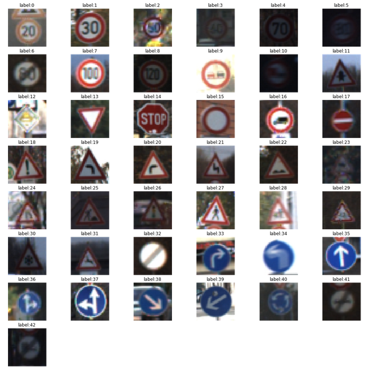
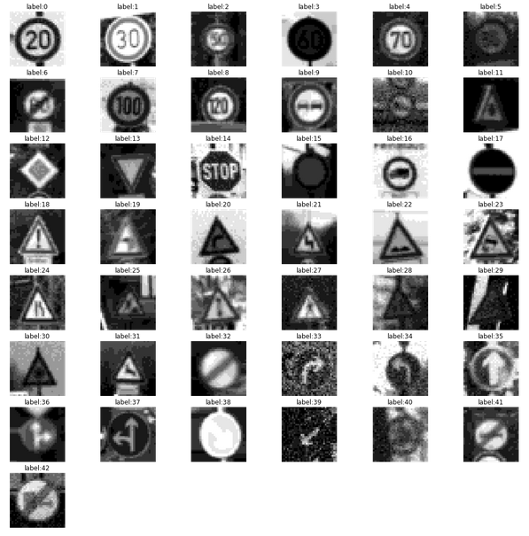

# **Traffic Sign Recognition** 

---

**Build a Traffic Sign Recognition Project**

The goals / steps of this project are the following:
* Load the data set (see below for links to the project data set)
* Explore, summarize and visualize the data set
* Design, train and test a model architecture
* Use the model to make predictions on new images
* Analyze the softmax probabilities of the new images
* Summarize the results with a written report

---
### Load the data set

Using pickle library to load traffic sign dataset which includes 43 kinds of traffic signs.

There are 34799 samples in training set, 4410 samples in validation set & 12630 samples in test set. 

The image shape is (32, 32, 3).

### Explore, summarize and visualize the data set

visualize 43 kinds of traffic signs using matplotlib library.



Using **imgaug** library to realize **IMAGE AUGMENTATION** by adding guassian noise and making image brighter or darker. 


### Design, train and test a model architecture

#### Preprocess

Firstly, convert train set images, validation set images and test set images from rgb to gray. Secondly, normalize them. Finally, display the preprocessed train set images.



#### Model architecture

My model consisted of layers:
| Layer         		|     Layer Info	        						|
|:---------------------:|:-------------------------------------------------:|
| Input         		| (32x32x1) Grayscale&Normalized image |
| Convolution 5x5     	| (1x1) stride, 'VALID' padding, outputs (28x28x6) |
| RELU					|													|
| Max pooling	      	| (2x2) stride,  outputs (14x14x6) 		|
| Convolution 5x5	    | (1x1) stride, 'VALID' padding, outputs (10x10x16) |
| RELU					|													|
| Max pooling	      	| (2x2) stride,  outputs (5x5x16) 		|
| Flatten	        	| outputs 400 										|
| Fully connected		| outputs 120  										|
| RELU					|													|
| Dropout				| keep probability = 0.5 							|
| Fully connected		| outputs 84  										|
| RELU					|													|
| Dropout				| keep probability = 0.5 						|
| Fully connected		| outputs 43 logits  								|

#### Hyper parameters

1. Number of epochs = 20


2. Batch size = 128

3. Learning rate = 0.001

4. Optimizer - Adam algorithm

5. Dropout = 0.5 for training set , Dropout= 1.0 for valid and test set

#### Data Set Accuracy

At first, Using the original LeNet-5 architecture, I got a accuracy of 0.89 in validation set. 

After preprocessing, I got a result of high training accuracy but a low validation accuracy, that means overfitting.

I tried to augment images, but got a voerfitting result again.

Finally, I apply a dropout layer into model architecture, get a good result.

My model accuracy results are:

- training set accuracy of 0.99368

- validation set accuracy of 0.95238

- test set accuracy of 0.93571

### Test a Model on New Images

Display the images which were found in web.


Some images like 1st and 4th and 7th one with complex background might be diffcult to classify. Some images like 2nd and 5th with noise and rotation might hard to classify.

After preprocessing


Using model to test the images get a result:

```
image:0 : Prediction Succeed
Label : 1 Prediction:1

image:1 : Prediction Succeed
Label : 3 Prediction:3

image:2 : Prediction Succeed
Label : 11 Prediction:11

image:3 : Prediction Succeed
Label : 0 Prediction:0

image:4 : Prediction Succeed
Label : 14 Prediction:14

image:5 : Prediction Succeed
Label : 38 Prediction:38

image:6 : Prediction Succeed
Label : 33 Prediction:33
```

